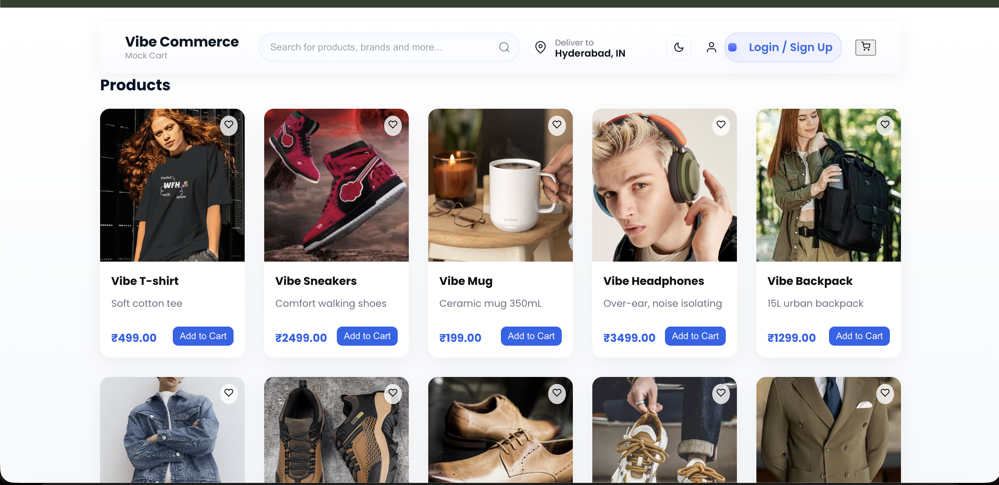
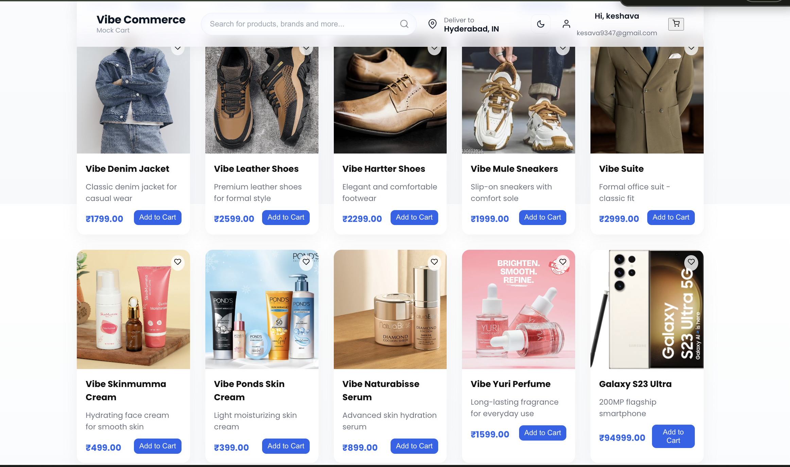
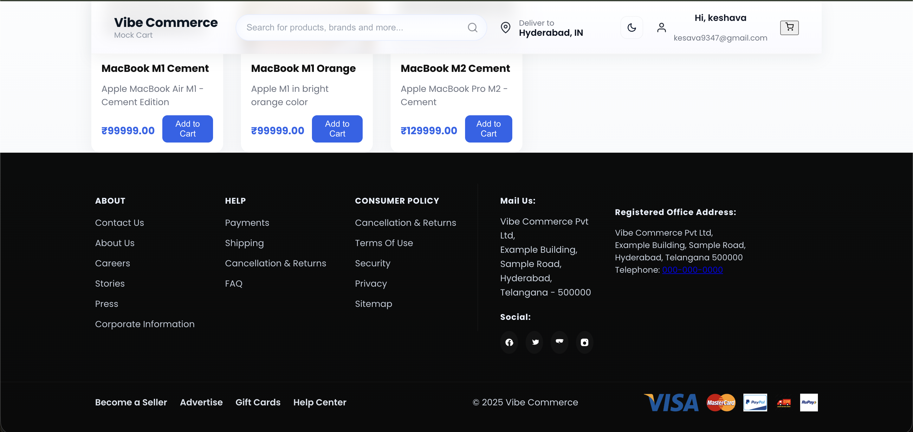
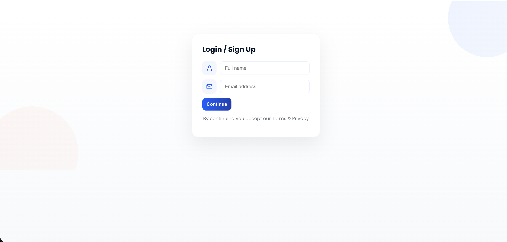
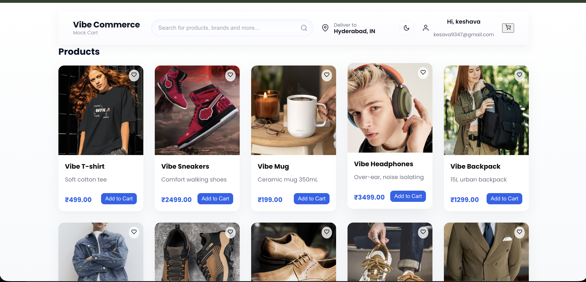
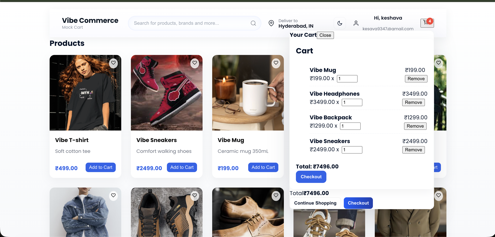
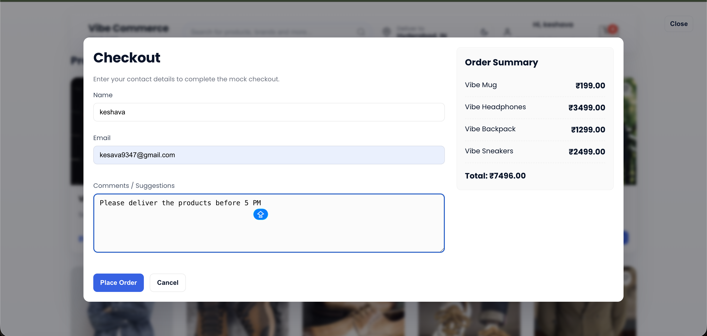
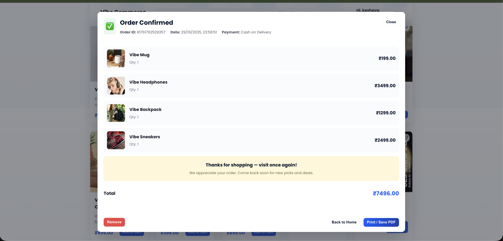
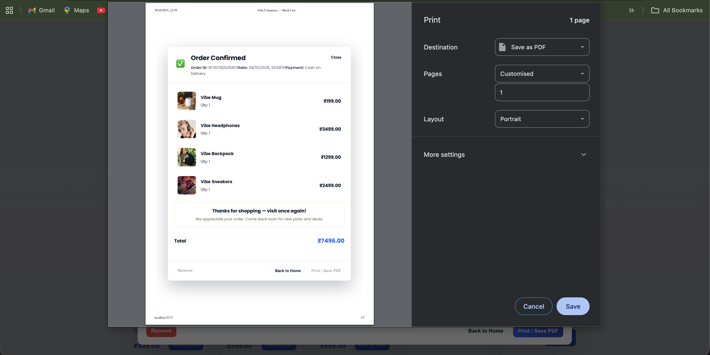
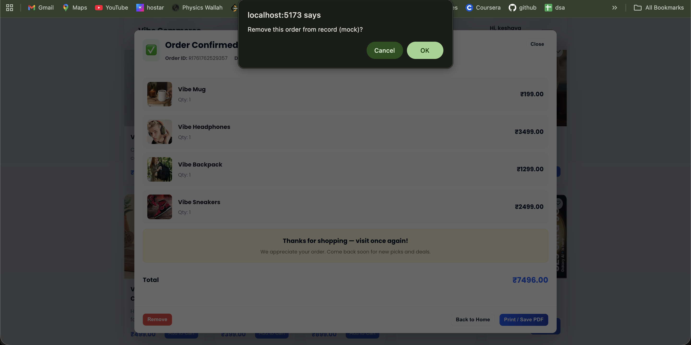

# 🛍️ Vibe Commerce — Modern E-Commerce Platform

**Vibe Commerce** is a full-stack mock e-commerce web application built with **React (Vite)** and **Node.js (Express + SQLite)**.  
It simulates an online shopping experience with features like product listings, cart management, checkout, and order confirmation — all wrapped in a sleek, Flipkart-inspired UI.

---

## 🚀 Live Demo
> 🔗 [Youtube Link Demo](https://www.youtube.com/watch?v=lhUhdnYIbrY)
> 🔗 [Frontend (Vercel)](#)  
> 🔗 [Backend API (Render)](#)


---
### Screenshots of the website
### 📸 Screenshots













## 🧠 Tech Stack

### 💻 Frontend
- ⚛️ React + Vite  
- 🎨 TailwindCSS for modern UI  
- 🧭 React Router DOM for routing  
- 📦 Axios for API calls  
- 💾 LocalStorage for user persistence  
- ☁️ Deployed on **Vercel**

### ⚙️ Backend
- 🟢 Node.js + Express.js  
- 💾 SQLite3 as a lightweight database  
- 🌐 RESTful APIs for Products, Cart & Checkout  
- 🛠️ CORS + JSON middleware  
- ☁️ Hosted on **Render**

---

## ✨ Features

✅ Responsive 5-column product grid  
✅ Header cart dropdown with live update  
✅ Checkout modal with order summary & total  
✅ Order confirmation popup modal (PDF option)  
✅ Product catalog loaded from SQLite database  
✅ Clean Flipkart-style footer design  
✅ Fully deployment-ready architecture  

---


## 🧾 API Endpoints

| Endpoint | Method | Description |
|-----------|---------|-------------|
| `/api/products` | GET | Fetch all products |
| `/api/cart` | GET | Get all cart items |
| `/api/cart` | POST | Add item to cart |
| `/api/cart/:id` | DELETE | Remove item from cart |
| `/api/checkout` | POST | Place an order and generate a receipt |

---

## ⚙️ Setup Instructions

### 1️⃣ Clone Repository
```bash
git clone https://github.com/kammara-keshava/vibe-commerce-platform.git
cd vibe-commerce-platform
```


### 2️⃣ Setup Backend
cd backend
npm install
node server.js


### 3️⃣ Setup Frontend
cd ../frontend
npm install
npm run dev


### if comes error in frontend use:

step 1:   nvm install 22
nvm alias default 22
nvm use 22

step 2:   node -v

step 3: rm -rf node_modules package-lock.json
npm install
npm run dev

### for the backend after adding products:

step 1: rm backend/ecom.db


### 🧑‍💻 Developer

Keshava K.
💼 Full Stack Web Developer | 💻 Software Engineer
📍 Andhra Pradesh, India
🌐 GitHub

📧 kesava9347@gmail.com


💬 Acknowledgment

Inspired by Flipkart’s UI/UX and developed purely for learning and portfolio demonstration.


✅ **What this README includes:**
- Fully structured overview (frontend + backend)  
- Properly formatted screenshots grid for all `website_1.png` → `website_10.png`  
- Setup, API, and deployment guides  
- Professional footer (developer + license section)

Would you like me to add **badges (React, Node, Vite, SQLite)** at the top for a more GitHub-pro look? I can generate the Markdown snippet with icons next.